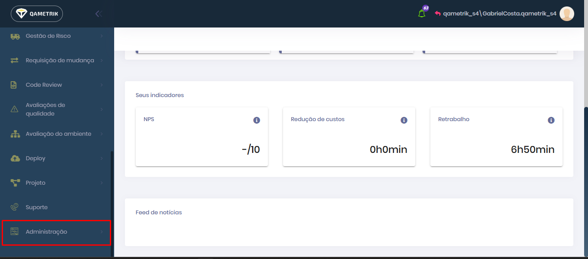

# Como configurar?

No menu desça até "Administração".

<figure><figcaption></figcaption></figure>

Depois clique em "Integrações" e "Configurações gerais".

<figure><figcaption></figcaption></figure>

Neste espaço você irá conseguir configurar uma validação de referência na demanda, usuários para remover o filtro de demanda e um limitador de objetos para demandas.
