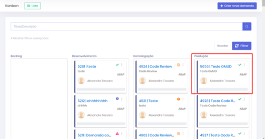
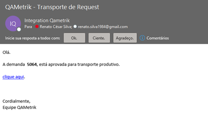

# Card Aprovado e E-mail de Comunicação

### Card Aprovado 

• O Card foi movimentado para o status “**Produção**” e liberada para realização do Deploy.&#x20;

• Clicando no card e na aba “**Gestão de Mudança**”, visualizamos as informações da mudança e status de aprovação. Após aprovação será enviado um e-mail indicado que a request está disponível para transporte no ambiente produtivo, somente para o tipo de transporte “**Manual**”.

<figure><figcaption>
Cards - Tela Gestão de Mudança
</figcaption></figure>

<figure><figcaption>
E-mail Enviado
</figcaption></figure>
