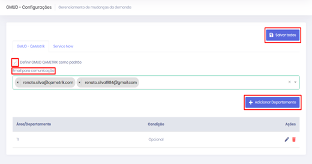

# Configuração de Tela de Departamentos

### Configuração Departamentos 

• Selecionar a opção Gestão de Mudanças;&#x20;

• Clicar no checkbox “**Definir GMUD QAMETRIK como padrão**";&#x20;

• Configurar o e-mail de comunicação;&#x20;

• Clicar no botão “**Adicionar Departamento**”;&#x20;

• Após realizar as configurações clicar no botão “**Salvar todos**”.

<figure><figcaption>
Configurações Departamentos
</figcaption></figure>
