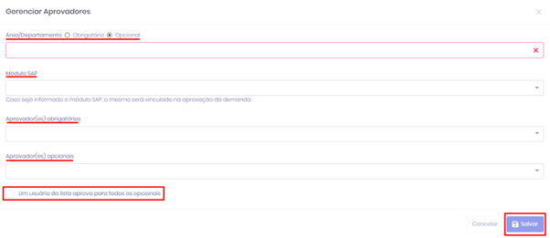
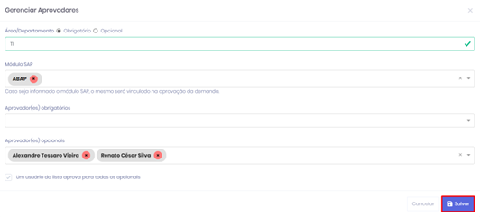
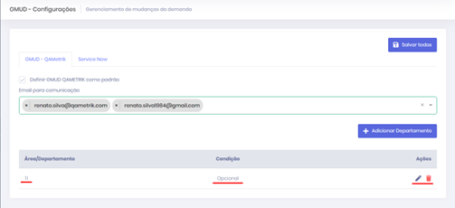

# Criação dos Departamentos

### Departamentos 

• Clicar no botão “**Adicionar Departamento**”;&#x20;

• Definir os departamentos que serão obrigatórios/opcionais e aprovadores.

<figure><figcaption>
Gerenciar Aprovadores
</figcaption></figure>

• Tela de configuração após o cadastro;&#x20;

• Caso haja necessidade o departamento pode ser vinculado ao “**Módulo SAP**”;&#x20;

• Selecionando a opção “**Um usuário da lista aprova para todos os opcionais**”, caso um aprovador realize o procedimento de “**Aprovar**” todos os opcionais serão aprovados de forma automática;&#x20;

• Clicar no botão “**Salvar**” para efetivar a configuração dos departamentos.

<figure><figcaption>
Gerenciar Aprovadores
</figcaption></figure>

• Clicar em “**Salvar Todos**”

<figure><figcaption>
GMUD Configurações
</figcaption></figure>
