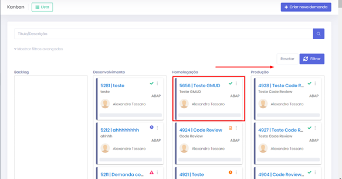
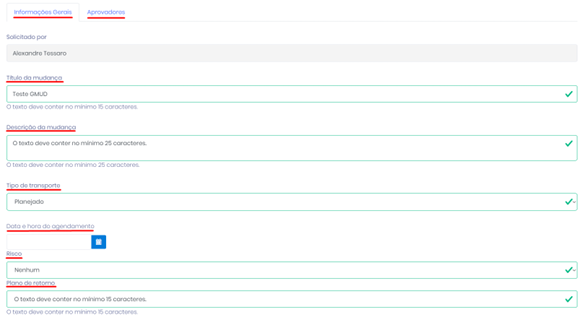
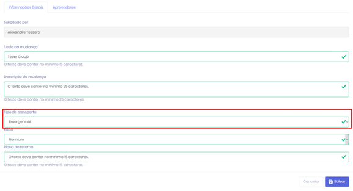
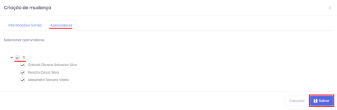
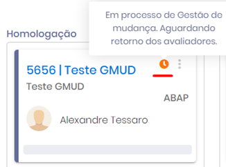
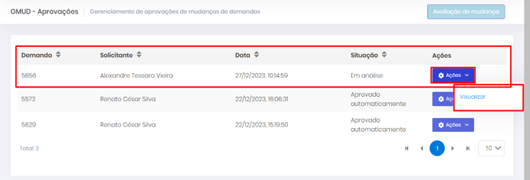
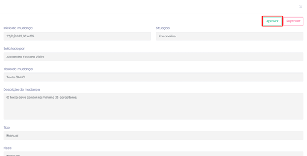
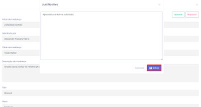

# Fluxo de Mudança do Card

### Fluxo de Mudança 

• Quando o card é movimentado de “**Homologação**” para “**Produção**”, a tela de Gestão de Mudança é exibida para preenchimento das informações.

<figure><figcaption>
Cards - Tela Gestão de Mudança
</figcaption></figure>

• Conforme solicitado, os campos destacados abaixo estão habilitados para alterar e com a definição de mínima de caracteres.

<figure><figcaption>
Modal Gestão de Mudança
</figcaption></figure>

• Nesta janela encontrará o campo “**Tipo de transporte**” que poderá selecionar o tipo de transporte a ser definido pelo analista responsável.

• Independentemente do Tipo de Transporte selecionado, a execução só será realizada após a aprovação da **GMUD**.

• Sobre os tipos de transporte:

• **Emergencial** – A request será liberada e transportada para produção. Lembrando que após a execução do JOB (a cada **10 minutos**).

<figure><figcaption>
Modal Gestão de Mudança
</figcaption></figure>

• **Manual** – A request será liberada e disponibilizada para transporte através do botão “**Deploy produtivo**”.

<figure><figcaption>
Modal Gestão de Mudança
</figcaption></figure>

• **Planejado** – A demanda será transportada para produção através da data/hora preenchida pelo analista. Lembrando que após a execução do JOB (a cada **10 minutos**).

• Os aprovadores podem ser desmarcados através da aba “**Aprovadores**”.

<figure><figcaption>
Modal Gestão de Mudança
</figcaption></figure>

• Após as definições clicar no botão “**Salvar**”, o card será atualizado com o ícone de “**Aguardando aprovação**”.

<figure><figcaption>
Card - Tela Gestão de Mudanças
</figcaption></figure>

### Aprovação 

Selecionar a opção no menu “**Aprovações**” e selecionar a demanda desejada para aprovação no caso “**4814**”, clicar no botão “**Ações**” e “**Visualizar**”.

<figure><figcaption>
Tela GMUD Aprovações
</figcaption></figure>

<figure><figcaption>
Modal Detalhes da Demanda
</figcaption></figure>

• Será solicitado a justificativa para aprovação, após o preenchimento clicar no botão “**Aprovar**”&#x20;

• Clicando no botão Salvar será realizado a aprovação para todos os aprovadores opcionais.&#x20;

• Caso seja necessário reprovar, clicando no botão “**Reprovar**” a **GMUD** será cancelada

<figure><figcaption>
Modal Justificativa
</figcaption></figure>
