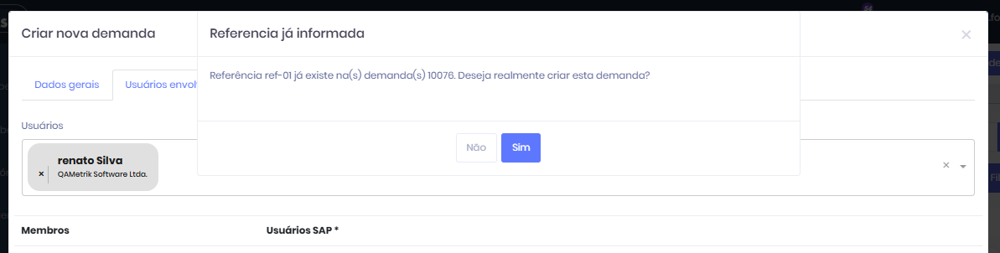
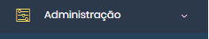
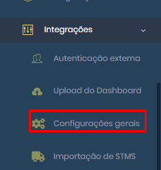
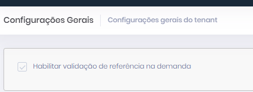

# Referencia de Demandas

Uma nova funcionalidade foi criada para validar o campo "Referência", assegurando a organização e a integridade dos dados ao evitar duplicidades no cadastro de demandas. Durante o registro de uma nova demanda, o sistema realiza uma verificação automática. Se uma demanda com a mesma referência já existir e seu status for até "Produção", será exibido um popup solicitando uma decisão do usuário.

<figure><figcaption></figcaption></figure>

A opção de validação foi criada através de parâmetro no produto, permitindo ao perfil Administrador gerenciar a ativação ou não.

Conforme o menu abaixo:

<figure><figcaption></figcaption></figure>

<figure><figcaption></figcaption></figure>

<figure><figcaption></figcaption></figure>
