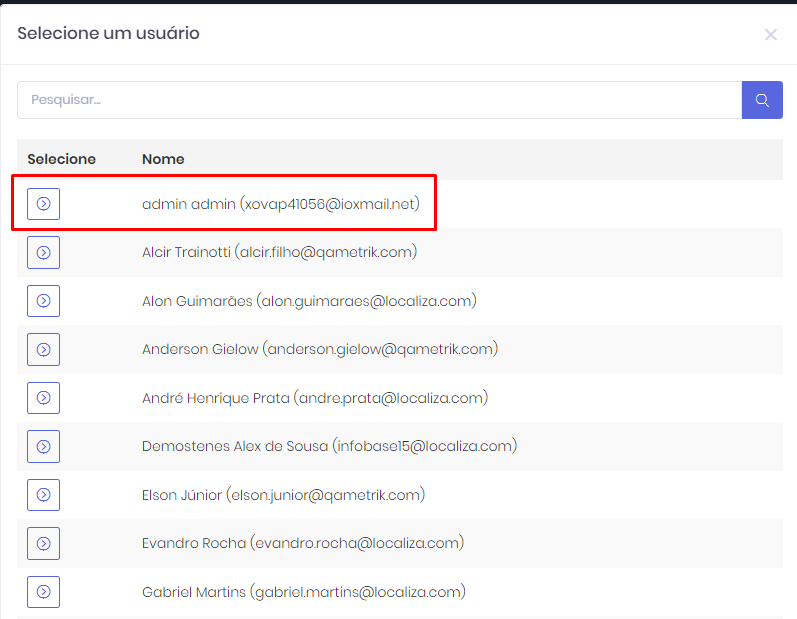
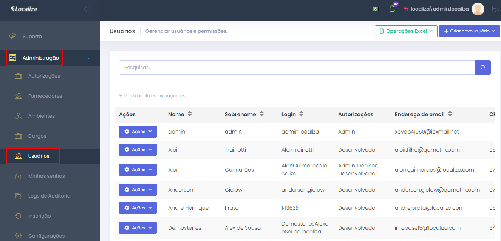

# Tutorial - Continuidade no processo de Criação de Usuário na ferramenta Portal

* Para criação de usuário, conforme solicitações vindas através da Ferramenta de suporte Tiflux, você deve acessar o portal Devops QAMetrik, nosso ambiente de produção, para efetuar o cadastro.

[https://devops.qametrik.com/app/notifications](https://devops.qametrik.com/app/notifications)&#x20;

* Selecione a opção Admin, para que possa criar um usuário dentro do cliente.

<figure><figcaption>
Pesquisa de Clientes
</figcaption></figure>

* Após estar logado como Admin, clique na aba Administração (lado esquerdo da página) e em Usuários.

<figure><figcaption>
Portal QAMetrik Devops
</figcaption></figure>

* Na parte superior ao lado direito da página terá um botão + Criar novo Usuário-Usuário DevOps, clique nele e aparecerá a tela de cadastro.

<figure><figcaption></figcaption></figure>

Informe os campos obrigatórios, como Nome e Sobrenome, Endereço de E-mail, CPF, Cargo (se o usuário informar) e Usuário SAP, mantenha selecionado as opções abaixo de: Enviar e-mail de ativação e Ativo, verifique na aba Autorizações se está selecionado a opção Desenvolvedor (é a única que deve estar flegada, caso não seja um Decisor, Gerente ou Administrador), depois clique em salvar.

<figure><figcaption></figcaption></figure>

*   Consulte o nome do usuário para confirmar que ele foi cadastrado corretamente e se está como Ativo.

    <figure><figcaption></figcaption></figure>
* Após realizado este processo informe o usuário os passos que ele deve seguir para finalizar seu cadastro e poder acessar o seu ambiente (Meus Acessos).

**Foi realizado o cadastro do seu usuário no Portal.**\
**Para criar o vínculo é necessário:**

**1** - Sair do portal (deslogar)\
**2** - Acessar seu e-mail, clicar no link de acesso ao portal e entrar com seu login e senha\
**3** - O seu acesso será criado em 'Meus acessos'.\
É necessário que você deslogue do sistema antes de acessar o link do e-mail, caso contrário o cadastro na Localiza não irá ocorrer.

**Obs: Também pode ser orientado ao usuário que existem passo a passo na aba treinamento da Ferramenta do Portal QADevops:**

<figure><figcaption></figcaption></figure>
