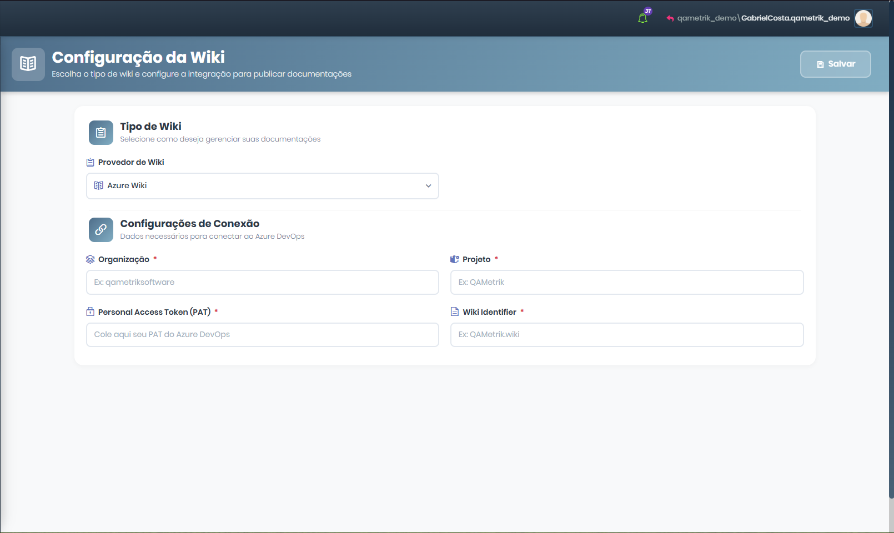

# Configuração

Na tela de **Configuração da Wiki**, é possível definir como a documentação será gerenciada e configurar a integração com provedores externos.

**Provedor de Wiki**

O usuário pode selecionar o provedor de Wiki que será utilizado:

* **Azure Wiki** (integração com Azure DevOps)
* **QAWiki** (gestão interna pela plataforma)

***

**Configurações de Conexão (Azure DevOps)**

Ao selecionar o provedor **Azure Wiki**, será necessário preencher os dados para conexão com o Azure DevOps:

* **Organização**\
  Nome da organização no Azure DevOps\
  &#xNAN;_&#x45;xemplo: qametriksoftware_
* **Projeto**\
  Nome do projeto dentro da organização\
  &#xNAN;_&#x45;xemplo: QAMetrik_
* **Personal Access Token (PAT)**\
  Token de acesso pessoal gerado no Azure DevOps, utilizado para autenticação\
  &#xNAN;_&#x4F; usuário deve colar o PAT válido neste campo_
* **Wiki Identifier**\
  Identificador da Wiki no Azure\
  &#xNAN;_&#x45;xemplo: QAMetrik.wiki_

***

**Observações**

* Todos os campos são obrigatórios para realizar a integração com o Azure
* O PAT deve possuir permissões adequadas para leitura e escrita na Wiki
* Após o preenchimento correto, será possível sincronizar as estruturas de pastas e documentos

<figure><figcaption></figcaption></figure>
