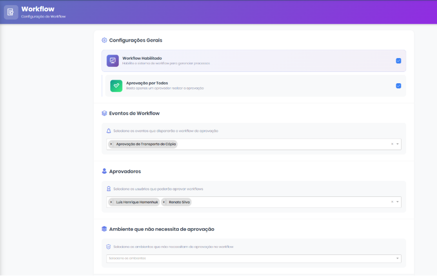

# Configuração

Na tela de configuração do workflow é possível:&#x20;

* Definir os aprovadores responsáveis&#x20;
* Selecionar o evento que dispara o fluxo (ex: Transporte de Cópia)&#x20;
* Determinar ambientes que não necessitam de aprovação&#x20;
* Ativar ou desativar a funcionalidade&#x20;

Essa parametrização permite flexibilidade conforme a política de governança do cliente.&#x20;

<figure><figcaption></figcaption></figure>
